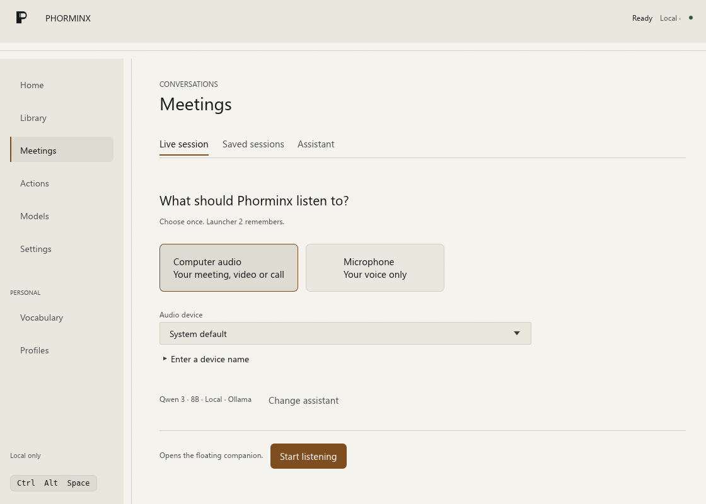
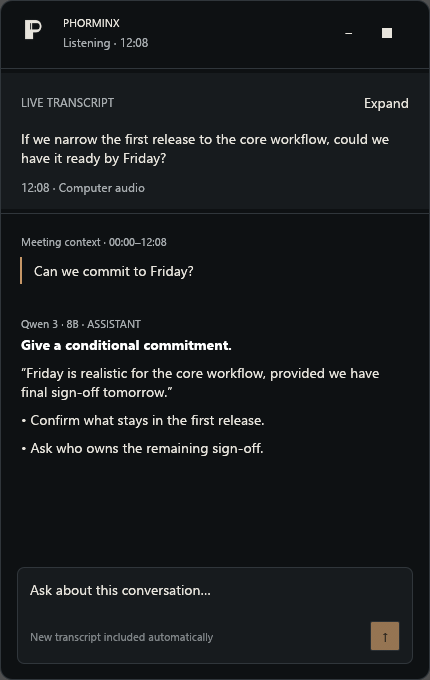

  

<h1 align="center">Phorminx</h1>

<strong>Voice, disciplined.</strong>

Local-first dictation and meeting assistance for Windows. Turn speech into text,
keep searchable notes, and use optional AI formatting without requiring a paid
AI service.

  <a href="docs/DEVELOPMENT.md">Build from source</a> ·
  <a href="#what-it-does">Features</a> ·
  <a href="#privacy-and-network-access">Privacy</a>

The Meetings workspace. Screenshots use synthetic demo data.

## What it does

- **Dictation:** resident Vosk recognition for Instant mode, or Whisper with
  optional Vulkan acceleration for Accurate mode. Transcription begins while
  speaking, using a bounded rolling audio buffer.
- **Formatting:** deterministic cleanup and an optional local Ollama model,
  with configurable formatting strength, a personal lexicon, and app profiles.
- **Meetings:** microphone or computer-audio capture, live transcripts, saved
  sessions, and a floating companion. Sending an assistant question includes
  newly captured transcript context without stopping capture.
- **Library:** exact-word and optional local semantic search over retained text.
- **Actions:** saved HTTP requests with transcript substitution or optional
  model-generated JSON, accessible from the launcher.
- **Desktop controls:** configurable shortcuts, light/dark appearance,
  model management, and setup/repair tools.

### Keep the meeting in view

The floating companion puts the live transcript and assistant beside the
conversation. Ask a question with the latest transcript context while capture
continues.

  

## Getting started

Phorminx targets Windows 10/11 x64. It is alpha software; recognition accuracy,
latency, and compatibility depend on the device, audio source, and model.

Build from source using the [development guide](docs/DEVELOPMENT.md).
Speech models and Vosk runtime assets are separate downloads and are not
included in this source repository. Configure them in the application's setup
and model screens. Ollama is optional; dictation can run without AI formatting.

The default `Ctrl+Alt+Space` shortcut opens the P launcher. Choose Dictate, speak,
then press the shortcut again to finish. Settings provides shortcut and
appearance preferences. Meetings and Actions have their own workspaces.

## Privacy and network access

Speech recognition runs locally. The production capture path keeps audio in
memory rather than saving recordings to disk. Retained text and settings live
under `%LOCALAPPDATA%\Phorminx`; use the application's history, session, and
deletion controls to manage stored text. Disabling dictation history does not
mean that separately saved meeting sessions have been deleted.

Local Ollama formatting and embeddings use local compute. Model downloads use
the network. Optional remote assistant providers and HTTP actions send the
configured text/context to the selected provider or destination. These options
are not a local-only privacy guarantee: remote providers may charge for usage
and apply their own data policies. Review the destination before enabling them.

Do not include real transcripts, recordings, credentials, or personal settings
in bug reports or contributions. Use synthetic examples instead.

## Documentation

- [Build, test, and package](docs/DEVELOPMENT.md)
- [Windows compatibility checks](docs/WINDOWS-COMPATIBILITY-PROTOCOL.md)
- [Architecture decision records](docs/README.md)
- [Production brand assets](design/brand/README.md)
- [Assistant transport contracts](crates/phorminx-assistant/README.md)

## License

Phorminx's original source is licensed under the [MIT License](LICENSE).
Third-party libraries, runtimes, and downloaded models retain their respective
licenses and notices; the project license does not replace those terms.
